# README
[](https://deploy.stdlib.com/)

# Slack app Website Scraper 

In the [last tutorial](https://github.com/JanethL/WebScraper), we learned how to use [crawler.api](https://stdlib.com/@crawler/lib/query) on Standard Library to scrape websites using CSS selectors and as an example, we scraped the front page of [The Economist](https://www.economist.com/) for titles and their respective URLs. 

In this guide, we will learn to retrieve and send our scraped data into Slack. We'll set up a Slack app that scrapes websites for links using a Slack slash command and posts the results inside a Slack channel like this:

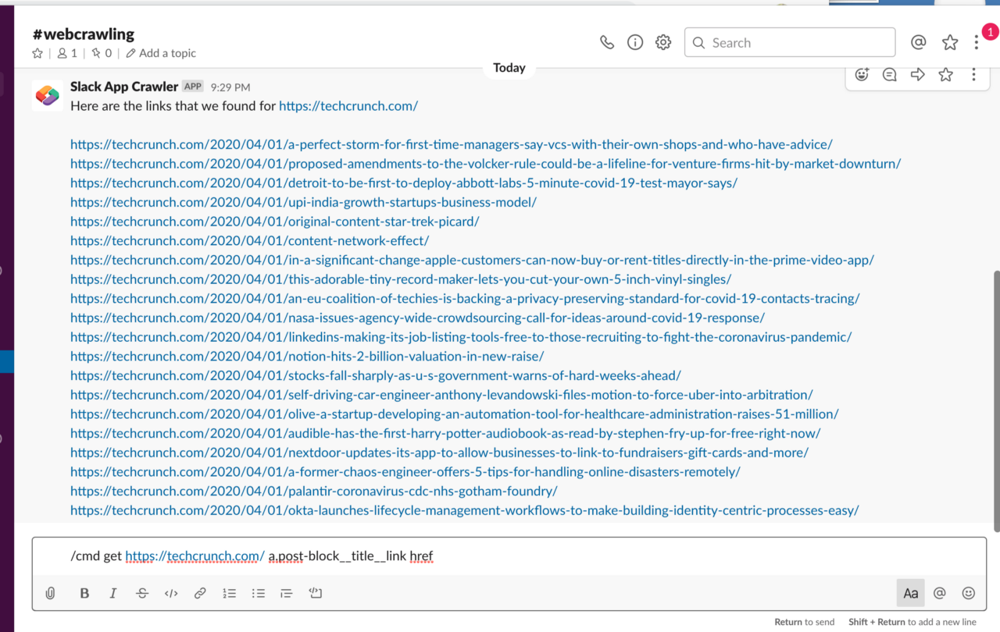

# Table of Contents

1. [How It Works](#how-it-works)
1. [Installation](#installation)
1. [Test Your Workflow](#test-your-workflow)
1. [Making Changes](#making-changes)
   1. [via Web Browser](#via-web-browser)
   1. [via Command Line](#via-command-line)
1. [Support](#support)
1. [Acknowledgements](#acknowledgements)

# How It Works

When you submit `/cmd scrape https://techcrunch.com/ a.post-block__title__link` (or any url followed by it's repective selector) in Slack’s message box, a webhook will be triggered. The webhook, built and hosted on [Standard Library](stdlib.com), will first make a request to [crawler.api](https://stdlib.com/@crawler/lib/query), which will return a JSON payload with results from the query. 

Our webhook will then create Slack messages for each event and post those to the channel where the command was invoked.

``` javascript 
const lib = require('lib')({token: process.env.STDLIB_SECRET_TOKEN});
/**
* An HTTP endpoint that acts as a webhook for Slack command event
* @param {object} event
* @returns {object} result Your return value
*/
module.exports = async (event) => {
  // Store API Responses
  const result = {slack: {}, crawler: {}};
  
  if ((event.text || '').split(/\s+/).length != 2) {
    return lib.slack.channels['@0.6.6'].messages.create({
      channel: `#${event.channel_id}`,
      text: `${event.text} has wrong format. `
    });
  }
  
  console.log(`Running [Slack → Retrieve Channel, DM, or Group DM by id]...`);
  result.slack.channel = await lib.slack.conversations['@0.2.5'].info({
      id: `${event.channel_id}`
  });
  console.log(`Running [Slack → Retrieve a User]...`);
  result.slack.user = await lib.slack.users['@0.3.32'].retrieve({
      user: `${event.user_id}`
  });
  
  console.log(`Running [Crawler → Query (scrape) a provided URL based on CSS selectors]...`);
  result.crawler.pageData = await lib.crawler.query['@0.0.1'].selectors({
      url: event.text.split(/\s+/)[0],
      userAgent: `stdlib/crawler/query`,
      includeMetadata: false,
      selectorQueries: [
          {
              'selector': event.text.split(/\s+/)[1],
              'resolver': `attr`,
              'attr': 'href'
          }
      ]
  });
  let text = `Here are the links that we found for ${event.text.split(/\s+/)[0]}\n \n ${result.crawler.pageData.queryResults[0].map((r) => {
    if (r.attr.startsWith('http://') || r.attr.startsWith('https://') || r.attr.startsWith('//')) {
        return r.attr;
    } else {
        return result.crawler.pageData.url + r.attr;
    }
  }).join(' \n ')}`;
  console.log(`Running [Slack → Send a Message from your Bot to a Channel]...`);
  result.slack.response = await lib.slack.channels['@0.6.6'].messages.create({
    channel: `#${event.channel_id}`,
    text: text
  })
  return result;
};

``` 
The first line of code imports an NPM package called “lib” to allow us to communicate with other APIs on top of Standard Library:

`const lib = require(‘lib’)({token: process.env.STDLIB_SECRET_TOKEN});` 

**Line 2–6** is a comment that serves as documentation and allows Standard Library to type check calls to our functions. If a call does not supply a parameter with a correct (or expected type) it would return an error.

**Line 7** is a function (module.exports) that will export our entire code found in lines 8–54. Once we deploy our code, this function will be wrapped into an HTTP endpoint (API endpoint) and it’ll automatically register with Slack so that every time a Slack command event happens, Slack will send the event payload for our API endpoint to consume.

**Line 11-16** is an if statement that handles improper inputs and posts a message to Slack using lib.slack.channels['@0.6.6'].messages.create. 

**Line 18-21** makes an HTTP GET request to the lib.slack.conversations[‘@0.2.5’] API and uses the info method to retrieve the channel object which has info about the channel including name, topic, purpose etc and stores it in result.slack.channel.

**Line 22-25** also makes an HTTP GET request to lib.slack.users[‘@0.3.32’] and uses the retrieve method to get the user object which has info about the user and stores it in result.slack.user.

**Line 27-39** is making an HTTP GET request to lib.crawler.query['@0.0.1'] and passes in inputs from when a Slack command event is invoked. 
   For the `url` we pass in the first input from our Slack event `event.text.split(/\s+/)[0]`.

   `userAgent` is set to the default: `stdlib/crawler/query` 

   `includeMetadata` is `False` (if True, will return additional metadata in a meta field in the response)

   `selectorQueries` is an array with one object, the values being {`selector`:`event.text.split(/\s+/)[1]`,`resolver':'attr`,    `attr`: `href`}

   For `selector` we retrieve the second input from the Slack event using `event.text.split(/\s+/)[1]`.  

**Lines 40–53** creates and posts your message using the parameters that are passed in: channelId, Text.

You can read more about API specifications and parameters here: https://docs.stdlib.com/connector-apis/building-an-api/api-specification/

# Installation

Click this deploy from Autocode button to quickly set up your project on Autocode.

[](https://deploy.stdlib.com/)

You will be prompted to sign in or create a **FREE** account. If you have a Standard Library account click **Already Registered** and sign in using your Standard Library credentials.

Give your project a unique name and select **Start API Project from Github** 
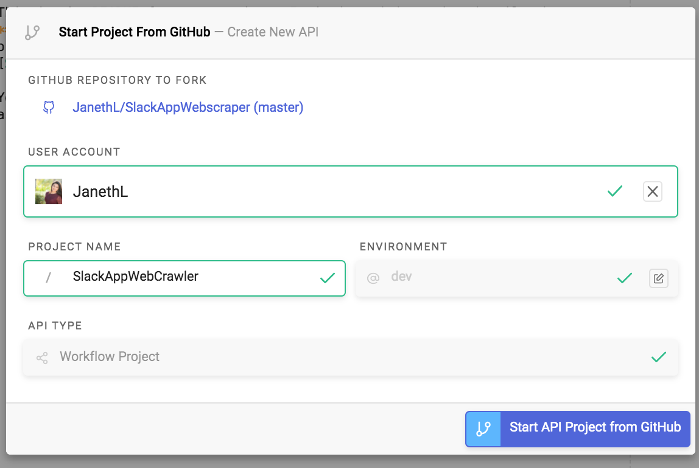

Autocode automatically sets up a project scaffold to save your project as an API endpoint, but it hasn’t been deployed.

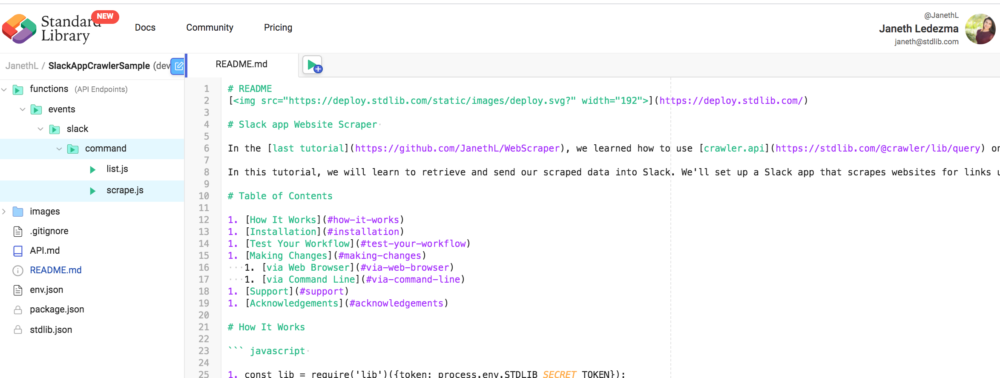

To deploy your API to the cloud navigate through `functions/events/slack/command/` folders and select `scrape.js` file. 

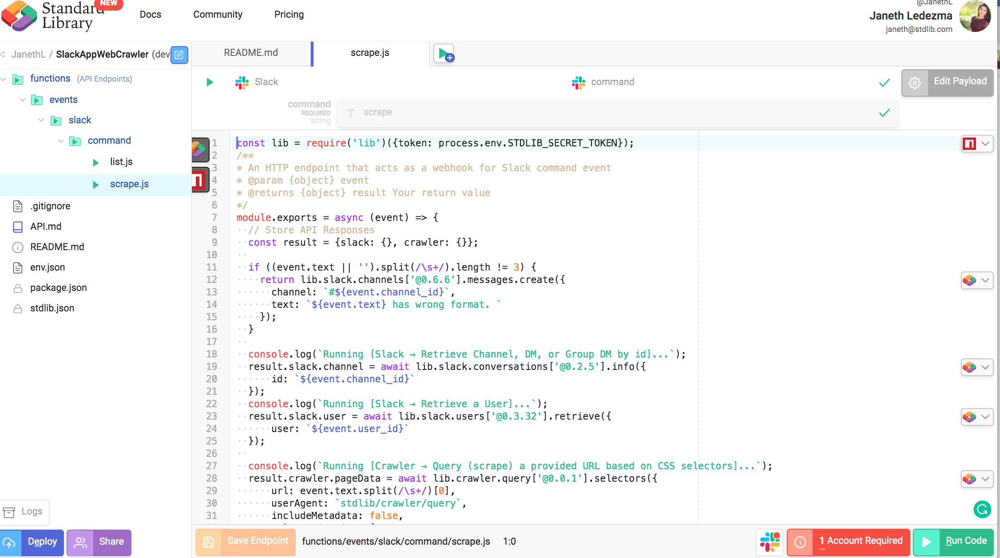

Select the **1 Account Required** red button which will prompt you to link a Slack account.

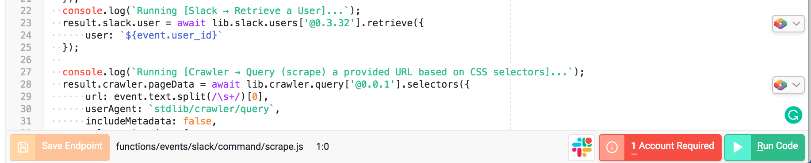

If you’ve built Slack apps with Standard Library, you’ll see existing Slack accounts, or you can select **Link New Resource** to link a new Slack app.

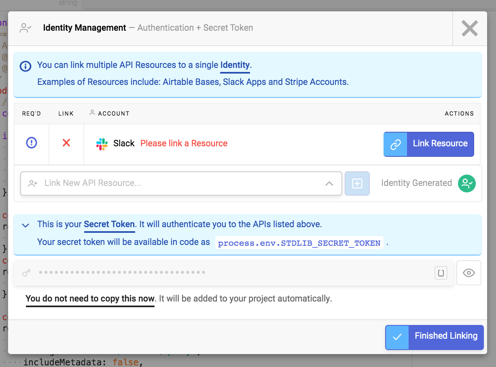

Select **Install Standard Library App**.

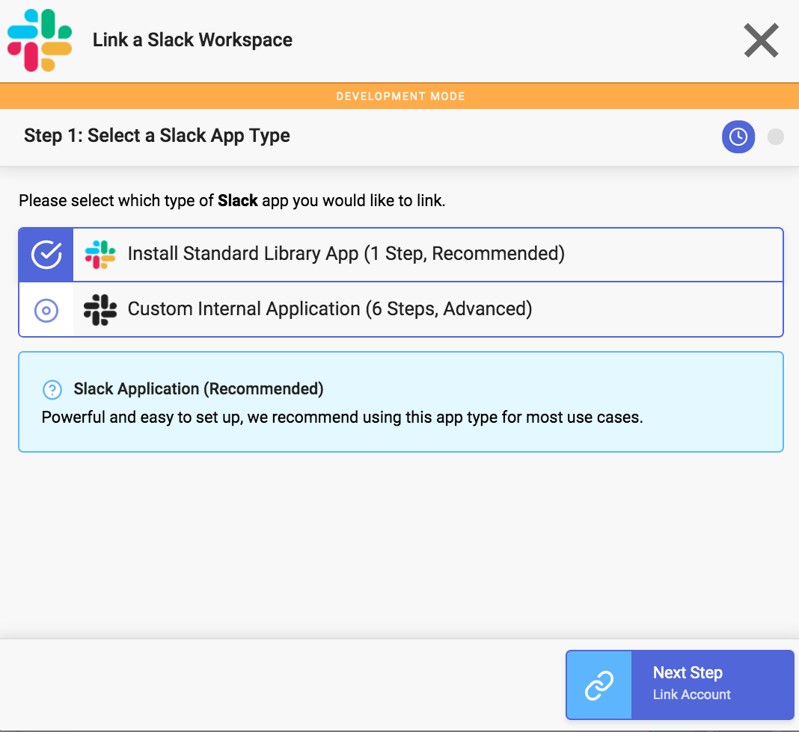

You should see an OAuth popup that looks sonething like this:

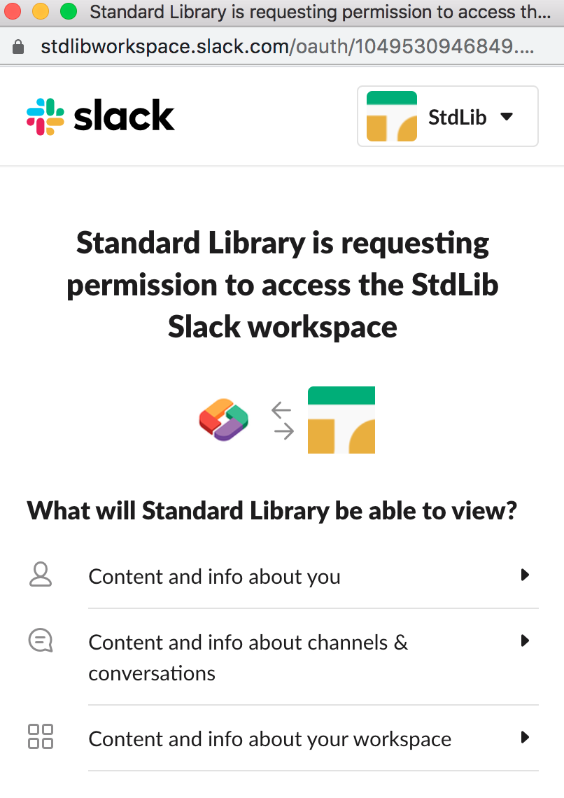

Select **Allow**. You'll have the option to customize your Slack app with a name and image.

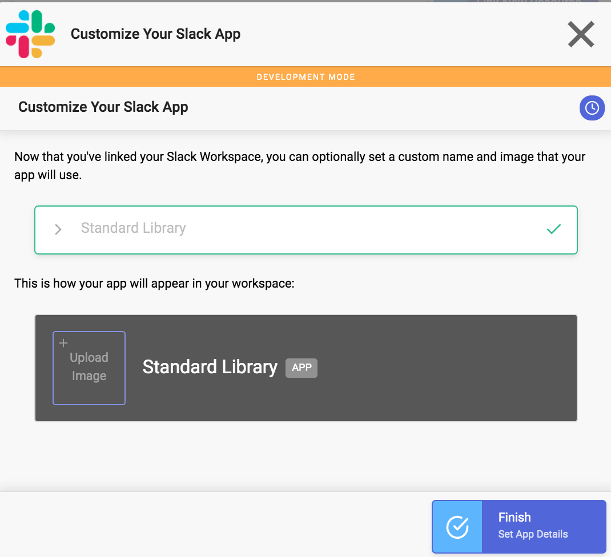

Select **Finish**. The green checkmarks confirm that you’ve linked your accounts correctly. Click **Finished Linking.**


To deploy your API to the cloud select **Deploy API** in the bottom-left of the file manager.

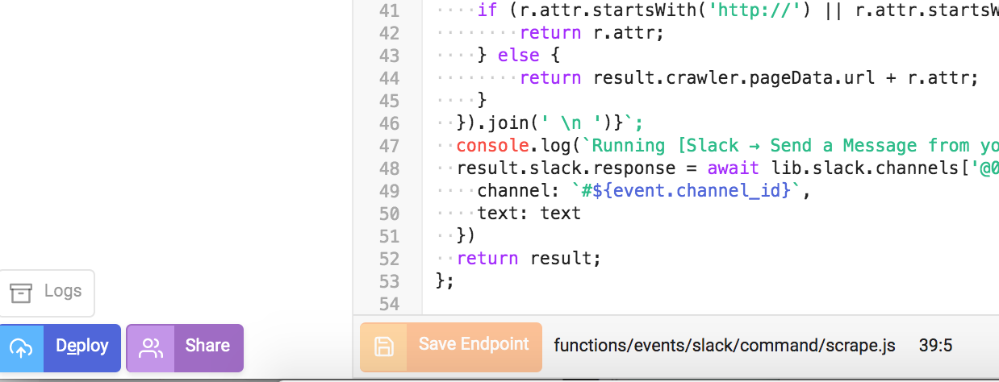

# Test Your Workflow 

You’re all done. Try it out! Your Slack App is now available for use in the Slack workspace you authorized it for. Your Slack app should respond to a `/cmd scrape <url> <selector>` as I show in the screenshot:


I've included an additional command that lists a few websites and their selectors to retrieve links. 

Just type `/cmd list` and you should see your app respond with the following message: 

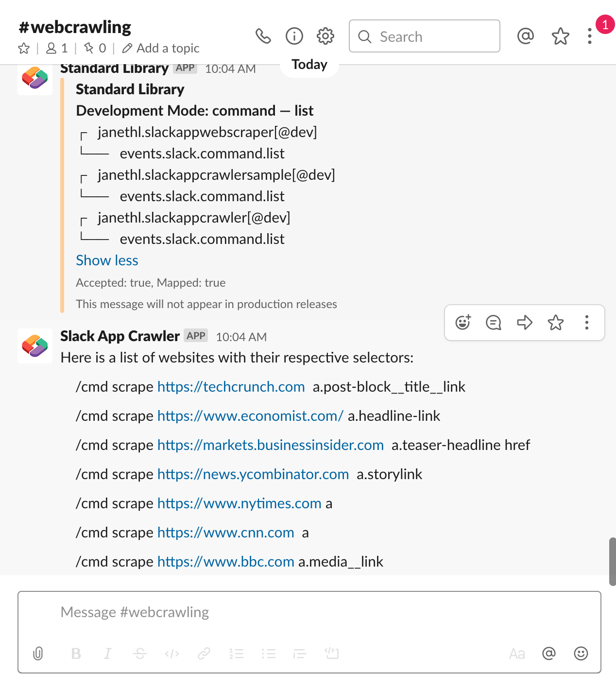

# Making Changes

Now that your app is live, you can return and add additional logic and scrape other attributes with [crawler.api](https://stdlib.com/@crawler/lib/query) 
  
# Making Changes

There are two ways to modify your application. The first is via our in-browser
editor, [Autocode](https://autocode.com/). The second is
via the [Standard Library CLI](https://github.com/stdlib/lib).

## via Web Browser

Simply visit [`Autocode.com`](https://autocode.com) and select your project. 
You can easily make updates and changes this way, save your changes and deploy directly from your browser.

## via Command Line

You can install the CLI tools from [stdlib/lib](https://github.com/stdlib/lib) to test,
makes changes, and deploy.


To retrieve your package via `lib get`...

```shell
lib get <username>/<project-name>@dev
```

```shell
# Deploy to dev environment
lib up dev
```

# Shipping to Production

Standard Library has easy dev / prod environment management, if you'd like to ship to production,
visit [`build.stdlib.com`](https://build.stdlib.com),
find your project and select `manage`.

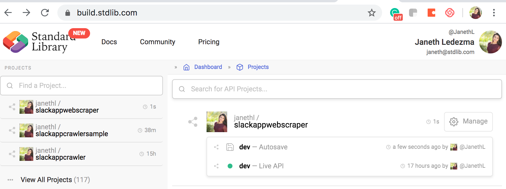

From the environment management screen, simply click **Ship Release**.

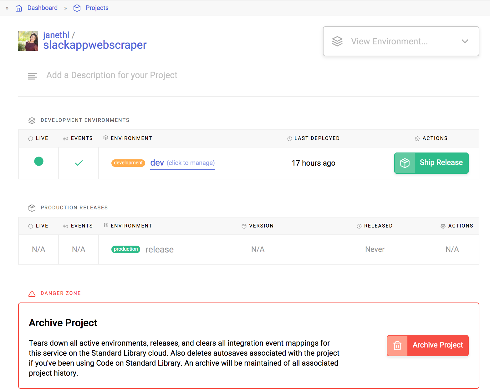

Link any necessary resources, specify the version of the release and click **Create Release** to proceed. 

That's all you need to do!

# Support

Via Slack: [`libdev.slack.com`](https://libdev.slack.com/)

You can request an invitation by clicking `Community > Slack` in the top bar
on [`https://stdlib.com`](https://stdlib.com).

Via Twitter: [@SandardLibrary](https://twitter.com/StandardLibrary)

Via E-mail: [support@stdlib.com](mailto:support@stdlib.com)

# Acknowledgements

Thanks to the Standard Library team and community for all the support!

Keep up to date with platform changes on our [Blog](https://stdlib.com/blog).

Happy hacking!
